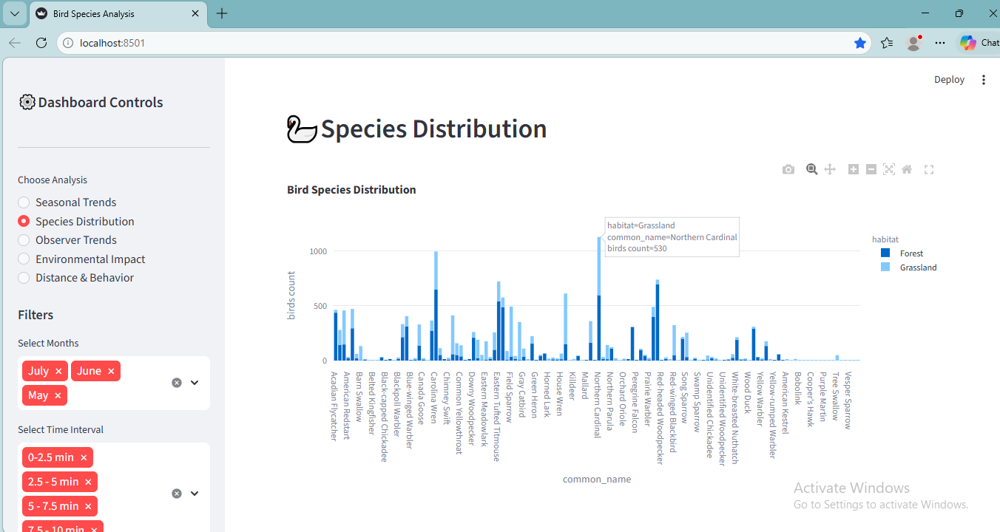
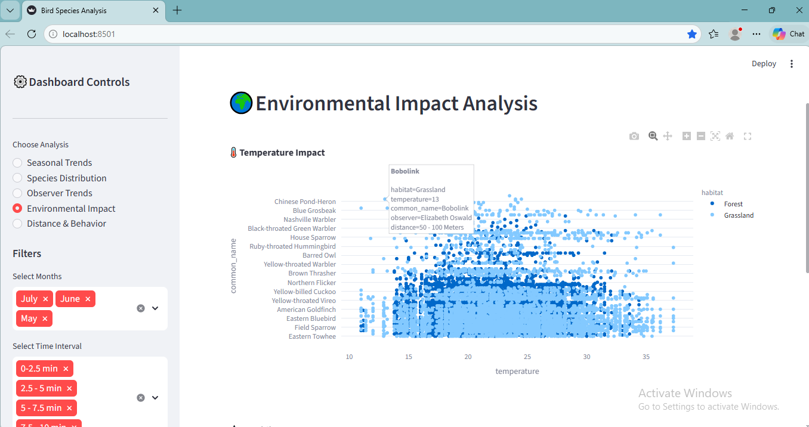

# 🐦 Bird Species Analysis Dashboard

An **interactive bird biodiversity analysis dashboard** built using **Python, SQL, and Streamlit**.
This project analyzes bird monitoring datasets to identify **species distribution, seasonal trends, and habitat patterns** across different environments such as **forests and grasslands**.

---

# 📌 Project Overview

Bird biodiversity monitoring is important for **wildlife conservation and ecosystem management**.
This project processes bird observation datasets, cleans and stores the data in a structured database, and presents insights through an interactive dashboard.

The dashboard allows users to explore:

• Bird species distribution
• Seasonal observation patterns
• Habitat comparison (Forest vs Grassland)
• Biodiversity monitoring insights

---

# 🚀 Features

✔ Data Cleaning and Preprocessing
✔ Handling Missing Values and Outliers
✔ Species Distribution Analysis
✔ Seasonal Bird Observation Trends
✔ Habitat Comparison
✔ Interactive Data Visualization

---

#  Technologies Used

## Software

* VS Code
* pgAdmin

## Programming Languages

* Python
* SQL

## Python Libraries

* Pandas
* Psycopg2
* SQLAlchemy
* Plotly

## UI Framework

* Streamlit

---

# 📊 Dashboard Screenshots

## Main Dashboard

## Species Distribution Visualization

## Environmental Impact

---

